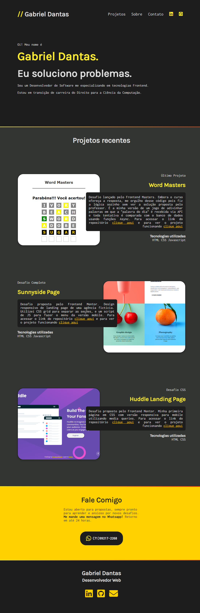

# portfolio-website

## Projeto de Portfolio proposto pelo curso do Frontend Masters

- Tentei reproduzir o design da forma mais fiel possível ao mesmo tempo em que mantive minha originalidade. 
- Não inspecionei o código da professora. Aproveitei a oportunidade para testar meus conhecimentos e fazer sozinho após olhar o modelo pronto.

## Link do desafio:
- https://gettingstartedwith.css.education/ch1.html

## Link de acesso:
- https://kirielss.netlify.app/

## Preview:
